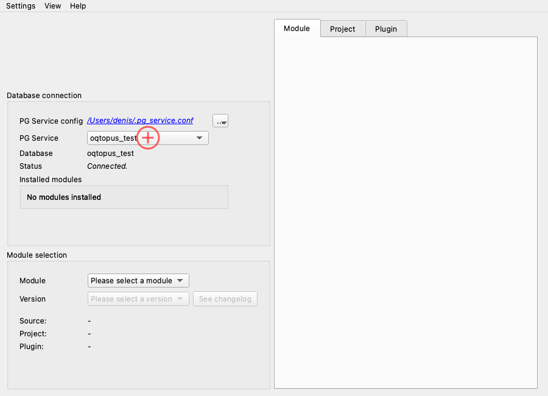
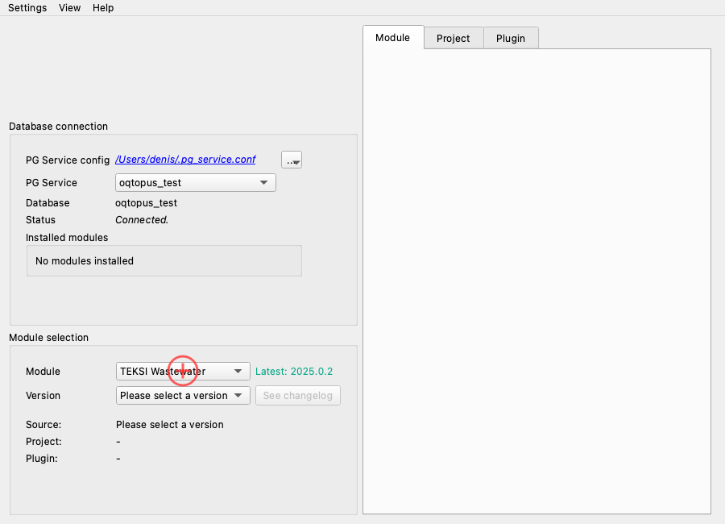
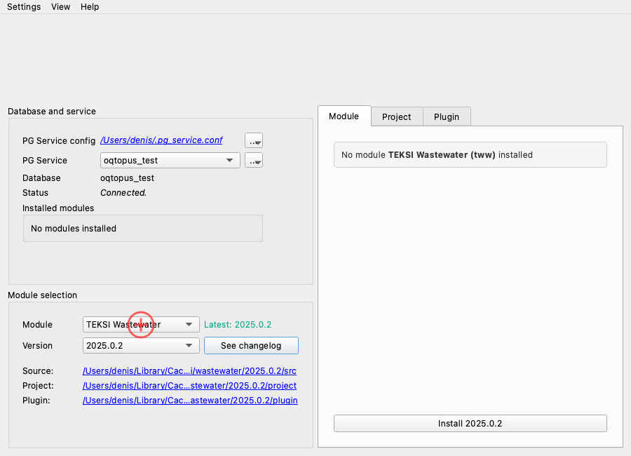
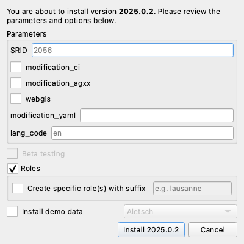
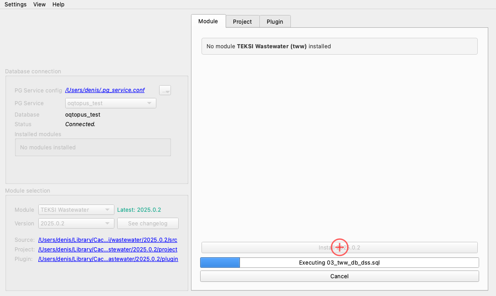

# Module Installation

This page walks through installing a module's PostgreSQL/PostGIS datamodel into a database.

## 1. Connect to a database

In the **Database Connection** box, select a PG service from the dropdown.
The service must be defined in your `pg_service.conf` file.

You can also use the **⋯** menu to:

- **Create database** — create a new empty database and add a PG service entry.
- **Duplicate database** — clone the currently connected database.
- **Reload PG Service config** — refresh the dropdown after editing `pg_service.conf`.

## 2. Select a module

In the **Module Selection** box, choose the module you want to install (e.g. *TEKSI Wastewater*).
oQtopus fetches the available versions from the module's GitHub repository.

## 3. Select a version

Pick the version you want to install from the version dropdown.
oQtopus downloads and prepares the release package automatically.

!!! note "Alternative sources"

    Besides official releases, you can also install from:

    - **Local ZIP file** — select *Load from ZIP file* in the dropdown.
    - **Local directory** — select *Load from directory*.
    - **Pre-releases and development branches** — select *Load pre-releases and development branches* to fetch additional versions including the main branch and open pull request branches.

## 4. Configure installation parameters

Click the **Install** button in the **Module** tab. The installation dialog opens:

{: style="max-width:500px"}

Here you can configure:

- **Roles** — whether to create and grant the PostgreSQL roles defined by the module.
- **Demo data** — optionally install a demo dataset.
- **Parameters** — advanced installation parameters specific to the module (e.g. default SRID, language).

## 5. Run the installation

Click **Install** in the dialog to start the operation. A progress bar shows the installation status.

Once the installation is complete, a success message is displayed and the installed module appears in the **Installed modules** list in the Database Connection box.
