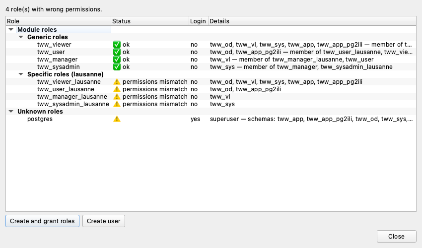

# Role Management

oQtopus provides a dedicated dialog for inspecting and managing the PostgreSQL roles defined by a module.

## Opening the dialog

In the **Module** tab, when the installed version matches the selected version, the **Maintain** view is displayed. Click **Check Roles** to open the role management dialog.

## Role inventory

The dialog shows a tree with four sections:

### Module roles

The roles defined in the module's PUM configuration, grouped by suffix (e.g. `_od`, `_sys`).
Each role shows its status:

- **✓ OK** — the role exists and has the expected permissions.
- **Missing** — the role does not exist in the database.
- **Permissions mismatch** — the role exists but its grants do not match the configuration.

### Grantee roles

Login roles that have been granted membership in one or more module roles.

### Unknown roles

Roles that have access to the module's schemas but are not part of the module configuration. These may be leftover roles from a previous installation or manually created roles.

### Login roles

Other login roles in the database that could potentially be granted access to the module.

## Actions

### Toolbar buttons

- **Create and grant roles** — create all missing module roles (optionally with a suffix) and grant the configured schema permissions.
- **Create login role** — create a new PostgreSQL `LOGIN` role with an optional password.

### Context menu (right-click)

Right-click on a role or group header to access:

- **Grant to** — grant a module role to a login user.
- **Revoke from** — revoke membership from a specific user.
- **Revoke permissions** — remove all schema permissions from a role.
- **Drop role** — drop a role from the database.
- **Grant all to** / **Drop all roles** — bulk operations on an entire group.

!!! tip "Automatic role creation during install/upgrade"

    Roles can also be created automatically during module installation or upgrade
    by enabling the **Create and grant roles** option in the install/upgrade dialog.
    The role management dialog is useful for post-installation adjustments.
