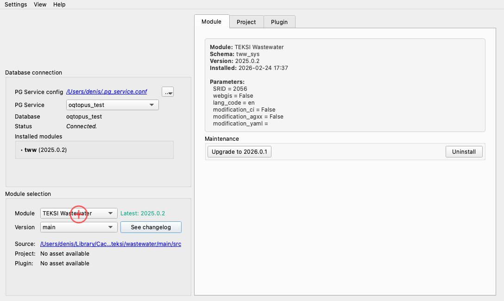
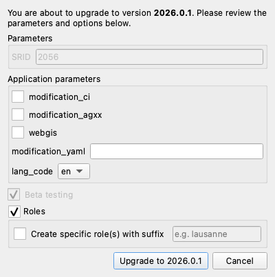
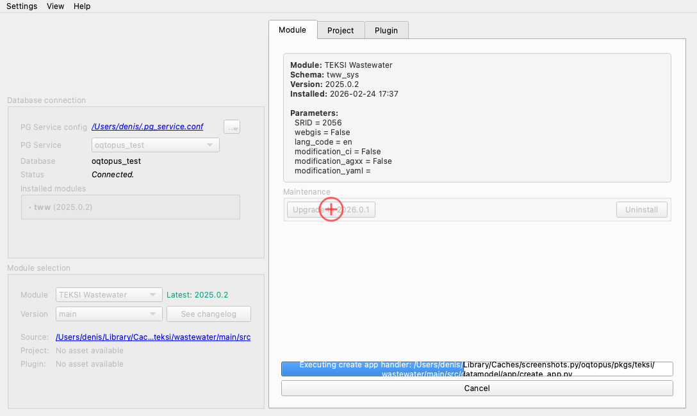

# Module Upgrade

This page explains how to upgrade an installed module to a newer version — including pre-releases and development branches.

## 1. Load development versions (optional)

If the target version is not listed in the version dropdown, select **Load pre-releases and development branches** to fetch additional versions from GitHub (branches from open pull requests, the main branch, etc.).

## 2. Select the target version

Choose the version or branch you want to upgrade to. oQtopus downloads and prepares the package.

When the selected version is newer than the installed version, the **Module** tab switches to upgrade mode and the **Upgrade** button becomes available.

## 3. Configure upgrade parameters

Click the **Upgrade** button. The upgrade dialog opens, pre-filled with the currently installed parameters:

{: style="max-width:500px"}

You can configure:

- **Parameters** — review and adjust module parameters. Values from the current installation are pre-filled.
- **Roles** — whether to create and grant roles during the upgrade.
- **Beta testing** — flag the installation as beta (allows reverting to the previous stable version later).

## 4. Run the upgrade

Click **Upgrade** in the dialog. The migration scripts are applied in order, upgrading the database schema from the installed version to the target version.

Once the upgrade is complete, a success message is displayed and the version shown in the **Installed modules** list is updated.

!!! warning "Beta testing"

    If you upgrade to a development branch with the **beta testing** flag enabled,
    you can later force-upgrade back to a stable release. The force option is
    automatically offered when oQtopus detects a beta-flagged installation.
